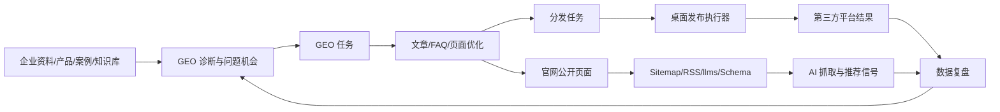

# 桐灼 GEO 增长工作台产品架构
<!-- ai_sampling_contract: platform surface prompt_id run_id model_version sampled_at mention recommendation rank citations competitor_mentions answer_accuracy dual_scoring -->
<!-- evidence_bound_plan_contract: evidence_source current_question owner deliverable acceptance_metric resample_date -->

本文档定义桐灼 GEO 增长工作台的产品形态、后台布局、GEORank 接入方式和阶段性交付边界。目标不是再做一个展示型后台，而是做一套可以给企业复制交付的 GEO 获客系统。

## 一、产品定位

桐灼 GEO 增长工作台是一套面向服务型企业的 AI 友好官网与 GEO 运营系统。它解决四件事：

1. 企业官网能被人看懂，也能被 AI 抓取、理解和引用。
2. 运营人员能在后台管理官网页面、行业资讯、FAQ、案例、联系方式和线索。
3. GEO 运营人员能做网站诊断、问题发现、关键词/问题机会、内容任务、文章生产和复盘。
4. 已发布内容能进入官网和第三方平台分发流程，发布状态可以回写后台。

一句话：客户买到的不是一个网站，也不是一个文章后台，而是“企业知识资产 -> AI 可见性诊断 -> 内容生产 -> 官网承载 -> 多平台分发 -> 线索回收”的增长闭环。

## 二、统一后台布局

后台只保留一个主系统，左侧竖向导航按运营角色组织。

```text
桐灼 GEO 增长工作台
├─ 总览
│  ├─ 经营看板
│  ├─ 今日待办
│  └─ 风险提醒
├─ 官网 CMS
│  ├─ 官网概览
│  ├─ 页面管理
│  ├─ 导航管理
│  ├─ 问题地图
│  ├─ 全站设置
│  └─ AI 抓取设置
├─ 内容中心
│  ├─ 行业资讯
│  ├─ 文章草稿
│  ├─ 分类/作者
│  ├─ 知识库
│  ├─ 关键词库
│  └─ 素材库
├─ GEO 运营
│  ├─ GEO 工作台
│  ├─ 网站诊断
│  ├─ 问题机会
│  ├─ AI 问答测试
│  ├─ 行动方案
│  └─ 任务中心
├─ 发布分发
│  ├─ 分发任务
│  ├─ 发布设备
│  ├─ 平台账号状态
│  └─ 结果回写
├─ 客户资产
│  ├─ 客户线索
│  ├─ 客户项目
│  └─ 交付档案
└─ 系统管理
   ├─ 模型配置
   ├─ API Token
   ├─ 账号权限
   └─ 操作日志
```

## 三、核心数据闭环



后台任何功能都必须落到这个闭环里。不能只做一个入口、一个按钮或一个好看的页面。

## 四、GEORank 如何结合

GEORank 的价值在于 GEO 引擎能力，不在于把它的整套前后台替换进来。GEORank 开源版包含网站诊断、AI 问答、GEO 方案、拓词工作台、JSON-LD/llms.txt 工具、API 池、FastAPI、Celery、PostgreSQL、Redis、Qdrant、Neo4j、MinIO 等能力。

桐灼系统的接入原则：

- Laravel/GEOFlow 继续作为主后台、权限、文章、CMS、线索、分发和交付模板中心。
- GEORank 改造成独立 GEO 引擎服务，只通过内部 API 给主后台提供诊断、问答、拓词和方案。
- 不把 GEORank 的 Next.js 管理台作为客户主后台，避免两个后台并存。
- 不在第一阶段强行部署 Qdrant、Neo4j、MinIO 全家桶，先用轻量引擎接口跑通产品闭环。
- GEORank 引擎失败时，主后台必须能降级使用本地规则诊断。

推荐架构：

```text
Laravel 主系统
├─ 官网 CMS
├─ 内容中心
├─ GEO 工作台
├─ 分发管理
├─ 发布设备
├─ 客户线索
└─ 产品交付模板
        │
        │ 内网 API
        ▼
GEO 引擎服务
├─ 本地规则引擎
├─ GEORank 网站诊断
├─ GEORank AI 问答
├─ GEORank 拓词
├─ GEORank 行动方案
└─ Schema/llms 工具
```

已在代码中预留的引擎配置：

```env
GEO_ENGINE_DRIVER=local
GEO_ENGINE_BASE_URL=
GEO_ENGINE_AUDIT_PATH=/api/geo/audits
GEO_ENGINE_ANSWER_TEST_PATH=/api/geo/answer-tests
GEO_ENGINE_OPPORTUNITIES_PATH=/api/geo/opportunities
GEO_ENGINE_PLAN_PATH=/api/geo/action-plans
GEO_ENGINE_API_KEY=
GEO_ENGINE_TIMEOUT_SECONDS=60
```

当 `GEO_ENGINE_DRIVER=georank` 时，后台会优先调用远程 GEORank 引擎；调用失败会回退到本地规则，不影响客户后台继续使用。

主后台和 GEO 引擎之间保持四个稳定能力接口：

- `auditWebsite`：网站诊断，返回问题、等级、证据和修复建议。
- `runAnswerTest`：AI问答测试，返回是否覆盖、观察答案、缺口摘要和证据来源。
- `expandOpportunities`：拓展问题机会，返回服务线、意图、关键词、问题和推荐内容形态。
- `generateActionPlan`：生成行动方案，返回方案摘要、目标指标和 30/60/90 天事项。

这四个接口由 `GeoEngineManager` 统一调度，本地规则引擎保底，GEORank 只做增强能力层。

## 五、功能模块设计

### 1. 官网 CMS

用户要能像管理成熟后台一样维护官网，不碰源码。

必须具备：

- 页面管理：首页、关于我们、产品中心、服务案例、团队、资质、行业资讯、问题地图、加入我们、联系方式。
- 页面模块：首屏、服务卡片、案例、FAQ、联系表单、SEO 信息。
- 动态内容：行业资讯和 FAQ 必须从后台新增、编辑、发布、下线。
- 全站设置：公司主体、短名称、联系电话、地址、官网域名、页脚、默认 SEO。
- AI 抓取：robots、sitemap、feed、llms、llms-full、JSON-LD 状态检查。

### 2. GEO 工作台

GEO 工作台不是单个诊断页面，而是运营任务中心。

必须具备：

- 网站诊断：检查页面结构、Meta、H1、Schema、Canonical、robots、sitemap、llms。
- AI 可见性诊断：接 GEORank 后检查 AI 是否能准确理解企业主体、产品、场景和可信来源。
- 问题机会：从客户业务词扩展“客户会问 AI 的问题”。
- 任务中心：每个问题自动变成官网修复、文章选题、FAQ、页面优化或分发任务。
- 行动方案：根据诊断结果生成 30/60/90 天运营计划。
- 结果复盘：看文章数、FAQ数、分发数、线索数、AI 抓取入口状态。
- 真实AI采样：记录平台、端、Prompt、Run、模型版本、采样时间、品牌出现、推荐、排名、引用、竞品出现和答案准确度。
- 双评分：资产质量分用于判断官网和内容是否可引用；AI表现分用于判断真实平台是否提到、推荐和准确描述品牌。

### 3. 内容中心

内容中心负责把 GEO 任务变成可发布资产。

必须具备：

- 行业资讯文章管理。
- 三类服务内容分类：GEO 优化、短视频运营、企业 AI 落地。
- 文章草稿、审核、发布、下线、删除。
- 文章发布后自动进入官网行业资讯。
- 文章发布后可创建分发任务。
- FAQ 可从 GEO 任务一键生成草稿。
- 证据型内容质量门：首段直接回答、事实/数字/案例、对比模块、操作步骤、FAQ、来源和更新时间、适用边界、可信表达。
- 每篇文章都要能进入“官网发布 -> 发布助手分发 -> AI问答复测”的运营闭环。

Yao/GEORank 的方法论接入重点不是复制后台，而是把内容从普通营销稿升级成证据页。文章列表必须能展示 GEO 质量分、分发状态、SEO/GEO 缺口和三条服务线覆盖情况。

### 4. 发布分发

服务器不直接保存第三方平台账号密码，也不绕过验证码。

推荐形态：

- 后台负责文章、平台选择、任务状态、结果展示。
- Windows 桌面发布执行器负责本地平台登录态、验证码、平台编辑器自动填充和结果回写。
- 首批稳定平台优先做微信公众号、知乎、头条号，不追求一开始支持几十个平台。
- 直接发布失败时，必须降级为草稿或待人工确认，不丢内容。

### 5. 客户交付模板

产品要能复制销售，必须模板化：

- 客户品牌配置。
- 客户官网域名配置。
- 客户后台路径配置。
- 客户数据库和上传目录隔离。
- 客户桌面发布执行器 Token 独立。
- 交付包不能包含客户 Token、Cookie、平台账号、浏览器 Profile。

## 六、阶段计划

### 第一阶段：可用闭环

目标：客户能真实使用官网、CMS、文章、FAQ、线索、基础 GEO 诊断和分发任务。

验收：

- 官网页面可访问，行业资讯和问题地图动态展示。
- 后台能编辑页面、发布文章、维护 FAQ、查看线索。
- GEO 工作台能做基础诊断，并生成任务。
- 诊断任务能生成文章草稿。
- 文章能发布到官网并进入分发队列。

### 第二阶段：成熟后台

目标：后台像成熟产品，而不是临时页面。

验收：

- 左侧导航清晰，官网 CMS、内容中心、GEO 运营、发布分发分区明确。
- 页面编辑器支持模块级编辑、发布、草稿和版本回滚。
- FAQ、文章、页面、线索、分发任务均可筛选、搜索、状态管理。
- 每个页面都有空状态、错误提示、成功提示和下一步动作。

### 第三阶段：GEORank 高级引擎

目标：把 GEORank 能力接入成 GEO 引擎。

验收：

- 主后台可切换 `local` 和 `georank` 引擎。
- 网站诊断可以返回高级 AI 可见性建议。
- 拓词生成问题机会。
- AI 问答测试能记录问题、回答、证据和改进建议。
- 行动方案能生成 30/60/90 天任务清单。

### 第四阶段：可复制商业交付

这一阶段的交付标准不是再多几个页面，而是能一键生成 `CustomerOpsBundle`，把项目档案、证据索引、上线评分、健康评分和组合索引一起打包给客户，方便复制、复盘和续约。

目标：做成可销售产品包。

验收：

- 一键生成客户实例。
- 一键生成交付包、上线预检、验收清单、培训文档。
- 支持版本升级、回滚、敏感信息扫描。
- 有标准演示流程和客户试点流程。

## 七、不能再做的错误方向

- 不做只有按钮没有动作的假入口。
- 不做两个互相独立的后台。
- 不把第三方平台账号密码保存在服务器里。
- 不把官网写成纯静态死页面后再靠人工同步。
- 不把 GEORank 全套系统生硬塞进当前后台。
- 不追求一次性支持所有平台，先把少数平台做稳定。
- 不在公开官网展示服务价格。

## 八、当前代码对应关系

```text
geoflow-integration/server-overrides/app/Services/GeoGrowth/
├─ GeoEngineClient.php
├─ GeoEngineManager.php
├─ LocalGeoEngineClient.php
└─ RemoteGeoRankEngineClient.php

geoflow-integration/server-overrides/app/Services/TongzhuoGeoAuditService.php
└─ 调用 GEO 引擎，落库诊断发现，生成 GEO 任务

geoflow-integration/server-overrides/resources/views/admin/geo-growth/
├─ index.blade.php
└─ audit.blade.php
   └─ GEO工作台展示增长闭环：官网页面、诊断、问题机会、文章、FAQ、分发、线索、客户项目；GEO任务支持生成文章草稿和FAQ草稿

geoflow-integration/server-overrides/app/Http/Controllers/Admin/GeoOpportunityController.php
└─ 管理问题机会，支持手工新增、生成基础机会、状态流转和转GEO任务

geoflow-integration/server-overrides/resources/views/admin/geo-opportunities/index.blade.php
└─ 问题机会运营池

geoflow-integration/server-overrides/app/Http/Controllers/Admin/GeoPlanController.php
└─ 生成和管理30/60/90天GEO行动方案，当前使用本地规则，后续接入GEORank方案引擎

geoflow-integration/server-overrides/resources/views/admin/geo-plans/
├─ index.blade.php
└─ show.blade.php

geoflow-integration/server-overrides/app/Http/Controllers/Admin/GeoAnswerTestController.php
└─ 管理AI问答测试，当前执行官网内容覆盖检测，后续接入GEORank/模型真实回答

geoflow-integration/server-overrides/resources/views/admin/geo-answer-tests/index.blade.php
└─ AI问答测试台，支持记录问题、运行检测、识别内容缺口并转问题机会

geoflow-integration/server-overrides/app/Http/Controllers/Admin/CustomerProjectController.php
└─ 管理客户项目和交付档案，支持生成当前站点档案、维护客户信息、服务线、上线端点、标准交付清单、验收证据、培训记录、版本升级记录、客户复盘、续费信号、交付报告和下一步动作

geoflow-integration/server-overrides/resources/views/admin/customer-projects/
├─ index.blade.php
├─ show.blade.php
└─ handoff-report.blade.php
   └─ 客户资产后台，连接官网CMS、GEO工作台、行业资讯、分发队列和客户线索，并显示交付进度、验收状态、续费跟进状态和可打印交付报告

geoflow-integration/deployment/
├─ install-geoflow-overrides.sh
├─ verify-geoflow-overrides.sh
└─ smoke-geoflow-workbench.sh
   └─ 服务器安装、文件/路由验收和上线烟测清单，确保部署包可交付、可验证、可回滚

scripts/Deploy-GeoFlowServer.ps1
└─ 本地部署助手，串联打包、上传、远程dry-run、可选安装、服务器验收和上线烟测，不保存服务器密码
```

## 九、下一步开发顺序

1. 把本地母版部署到服务器覆盖层，执行迁移、PHP lint、路由检查和真实后台烟测。
2. 在 GEO 工作台首页补完整闭环视图：诊断 -> 问题机会 -> 文章/FAQ/页面 -> 官网 -> 分发 -> 线索 -> 客户项目。
3. 部署轻量 GEO 引擎服务，先实现与 GEORank 兼容的诊断接口。
4. 接入 GEORank 的问答、拓词和行动方案能力，把结果写回问题机会、AI问答测试和行动方案。
5. 把客户项目继续扩展成正式交付档案：截图/文件上传、独立版本升级历史表、客户复盘报告导出为PDF/Word。
6. 稳定发布执行器：少量核心平台先跑通，结果可回写，失败有人工确认和重试流程。

参考来源：

- GEORank GitHub 仓库：https://github.com/yaojingang/GEORank
- GEORank README：https://raw.githubusercontent.com/yaojingang/GEORank/main/README.md
