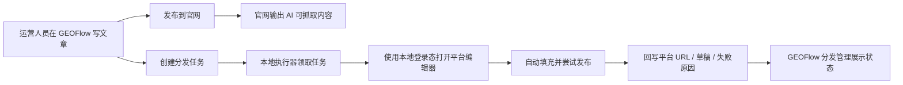

# 桐灼 GEO Growth OS 产品蓝图

## 产品定位

桐灼 GEO Growth OS 是面向服务型网络公司的企业获客系统，核心目标是把“企业知识沉淀、GEO 内容生产、官网被 AI 抓取、多平台内容分发、线索回收”做成一套可复制交付的产品。

产品由三部分组成：

1. GEOFlow 云端工作台：内容生产、审核、官网发布、分发任务、线索、客户项目管理。
2. AI 友好官网：面向客户和 AI 抓取，输出文章详情、行业资讯、Sitemap、RSS、llms.txt、结构化数据。
3. 桐灼发布执行器：安装在运营人员 Windows 电脑上，负责第三方平台登录态、验证码处理、平台页面自动化和发布结果回写。

## 为什么采用“云端工作台 + 本地执行器”

第三方内容平台的登录、验证码、滑块、安全校验、设备指纹和账号风控通常不适合放在服务器里硬跑。服务器统一登录第三方账号会遇到验证码无法拖动、短信无法获取、设备异常、账号被风控等问题。

本地执行器放在客户自己的电脑上运行，平台会把它识别为真实运营设备。GEOFlow 仍然是总控台：文章在后台写，分发任务在后台建，状态在后台看；本地执行器只领取任务并完成真正的发布动作。

## 首版产品边界

首版不追求“所有平台全自动无人工”，而是追求稳定闭环：

- GEOFlow 能创建文章并发布到官网。
- GEOFlow 能创建多平台分发任务。
- 本地执行器能和 GEOFlow 绑定设备。
- 本地执行器能管理平台账号登录态。
- GEOFlow 后台能看到设备在线、账号状态、任务执行状态。
- 至少 3 个重点平台完成可用适配：知乎、微信公众号、头条号。
- 直接发布失败时，必须能降级为草稿/待人工确认，不丢内容。

## 模块规划

### 1. 工作台

- 首页经营看板
- 文章管理
- 行业资讯
- 分发管理
- 发布设备
- 平台账号
- 官网线索
- 客户项目
- AI 可见度监测

### 2. 官网

- 首页
- 服务产品页
- 行业资讯列表
- 文章详情
- 关于我们
- 联系我们
- Sitemap、RSS、llms.txt、llms-full.txt
- 文章结构化数据和组织结构化数据

### 3. 发布执行器

- GEOFlow 绑定
- 设备心跳
- 平台账号登录
- 独立浏览器 Profile
- 任务轮询
- 平台适配器
- 人工接管
- 执行截图和结果回写

## 关键数据流

## 安全原则

- 平台密码、Cookie、验证码不上传云端。
- 每个客户使用独立域名、数据库、Token、设备绑定。
- 本地执行器的设备 ID 和密钥只保存在客户电脑。
- 公开官网不展示价格。
- 直接发布必须保留人工确认和草稿回退路径。

